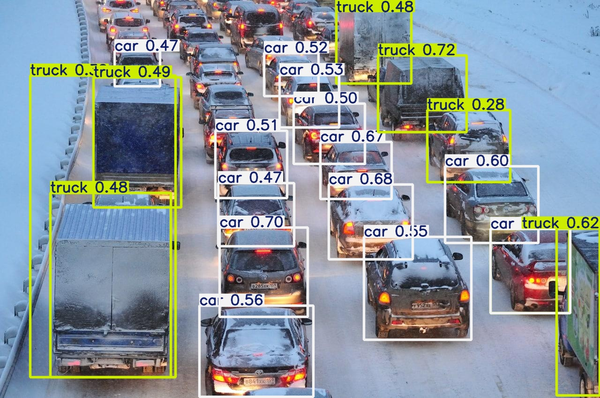
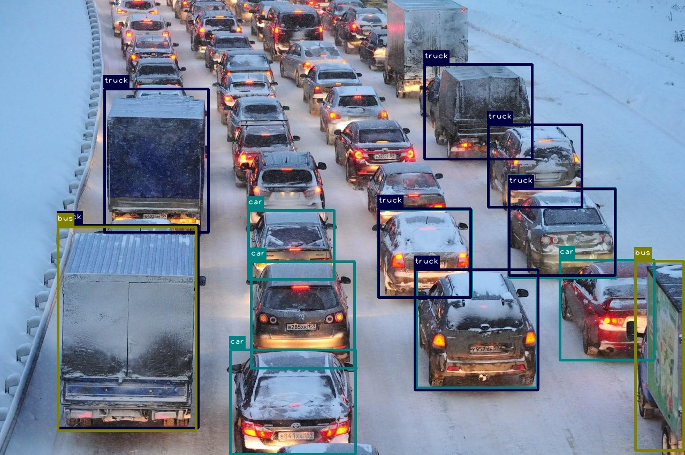

# YOLO на Raspberry Pi 5: CPU vs AI-ускоритель Hailo

Проверка работы детекции объектов **YOLO** на одноплатном компьютере
**Raspberry Pi 5** в двух режимах и **сравнение их скорости**:

1. **CPU** — модель YOLOv11n через Ultralytics (без ускорителя).
2. **NPU** — модель YOLOv8s на AI-ускорителе **Hailo-8L** (Raspberry Pi AI Kit).

Камера не использовалась — распознавание на готовых изображениях и видео.
Главный результат — **ускоритель Hailo даёт ~13× прирост скорости** относительно CPU.

## Стек и железо

| Компонент      | Значение                                       |
|----------------|------------------------------------------------|
| Плата          | Raspberry Pi 5, 8 GB LPDDR4X                   |
| Процессор      | Broadcom BCM2712, 4×Cortex-A76 (aarch64)       |
| AI-ускоритель  | Hailo-8L, 13 TOPS (Raspberry Pi AI Kit, M.2)   |
| ОС             | Raspberry Pi OS (64-bit, Debian)               |
| CPU-инференс   | YOLOv11n, Ultralytics 8.4.x, PyTorch (CPU)     |
| NPU-инференс   | YOLOv8s, DeGirum PySDK + HailoRT 4.23          |

## Структура проекта

```
.
├── README.md            — описание проекта (этот файл)
├── detect.py            — детекция на картинке (CPU)
├── benchmark.py         — замер скорости (CPU)
├── detect_hailo.py      — детекция на картинке (ускоритель Hailo)
├── benchmark_hailo.py   — замер скорости (Hailo, 320×320)
├── benchmark_hailo_640.py — замер скорости (Hailo, 640×640)
├── video_hailo.py       — детекция на видео (Hailo) + FPS
├── requirements.txt     — зависимости
├── images/input.jpg     — исходная картинка
├── videos/              — исходные видео
└── results/
    ├── input.jpg          — картинка с рамками (CPU)
    ├── benchmark.txt      — отчёт о замере (CPU)
    ├── hailo.jpg          — картинка с рамками (Hailo)
    ├── benchmark_hailo.txt — отчёт о замере (Hailo 320)
    └── benchmark_hailo_640.txt — отчёт о замере (Hailo 640)
```

## Установка

### Часть 1 — CPU (Ultralytics)
```bash
sudo apt update
sudo apt install -y python3-pip python3-venv libgl1
python3 -m venv yolo
source yolo/bin/activate

# PyTorch в CPU-версии (важно для Pi — без CUDA-пакетов NVIDIA)
pip install torch torchvision --index-url https://download.pytorch.org/whl/cpu
pip install ultralytics
```

> **Важно:** на Raspberry Pi PyTorch нужно ставить именно из CPU-репозитория —
> обычная установка тянет гигабайтные CUDA-пакеты NVIDIA, бесполезные на Pi.

### Часть 2 — AI-ускоритель Hailo
```bash
# Софт Hailo (драйвер + рантайм)
sudo apt install -y hailo-all
sudo raspi-config   # Advanced → PCIe Speed → Gen 3
sudo reboot

# Проверка, что ускоритель виден
hailortcli fw-control identify

# Библиотека для запуска YOLO на Hailo из Python
source yolo/bin/activate
pip install degirum degirum_tools
degirum token install --token <ВАШ_ТОКЕН_DEGIRUM>
```

## Запуск

```bash
# CPU
python3 detect.py          # детекция на картинке
python3 benchmark.py       # замер скорости

# Hailo
python3 detect_hailo.py    # детекция на картинке
python3 benchmark_hailo.py # замер скорости
python3 video_hailo.py     # детекция на видео
```

## Результаты

### Детекция (одно и то же фото — уличная пробка)

| | CPU (YOLOv11n) | Hailo (YOLOv8s) |
|---|---|---|
| Найдено объектов | 21 | 16 |
| Результат |  |  |

> Hailo нашёл меньше объектов, т.к. модель меньше и вход 320×320 против 640×640 на CPU —
> это компромисс ради скорости.

### Скорость — главное сравнение

| Конфигурация                | Время/картинку | FPS      | Ускорение vs CPU |
|-----------------------------|----------------|----------|------------------|
| CPU — YOLOv11n, 640×640     | 371 мс         | 2.70     | 1×               |
| Hailo — DAMO-YOLO, 640×640  | 100 мс         | 9.96     | **≈ 3.7×**       |
| Hailo — YOLOv8s, 320×320    | 28.4 мс        | **35.2** | **≈ 13×**        |

- При **одинаковом разрешении 640×640** ускоритель Hailo быстрее CPU примерно в **3.7 раза**.
- Если перейти на лёгкую модель с входом 320×320 (компромисс по точности),
  Hailo выдаёт **35 FPS** — в **13 раз** быстрее CPU.

Отчёты: [`results/benchmark.txt`](results/benchmark.txt) (CPU),
[`results/benchmark_hailo.txt`](results/benchmark_hailo.txt) (Hailo 320),
[`results/benchmark_hailo_640.txt`](results/benchmark_hailo_640.txt) (Hailo 640).

## Выводы

- YOLO **успешно запускается** на Raspberry Pi 5 и на CPU, и на ускорителе Hailo-8L.
- На CPU — **2.7 FPS** (≈371 мс/картинку): годится для офлайн-обработки отдельных изображений.
- При **одинаковом разрешении 640×640** Hailo быстрее CPU в **~3.7 раза** (≈10 FPS против 2.7).
- С лёгкой моделью 320×320 Hailo выдаёт **35 FPS** (**~13×**) — уже пригодно
  для видео в реальном времени, ценой небольшого снижения точности.
- Главный вывод: для задач компьютерного зрения в реальном времени на Raspberry Pi 5
  **AI-ускоритель даёт принципиальный прирост** по сравнению с одним CPU.

## Возможные улучшения

- Сравнение «одна и та же модель» на CPU и Hailo (например, YOLOv8s в обоих случаях).
- Замер при одинаковом разрешении входа (640×640) для честного сравнения «как есть».
- Подключение камеры и детекция в реальном времени.
